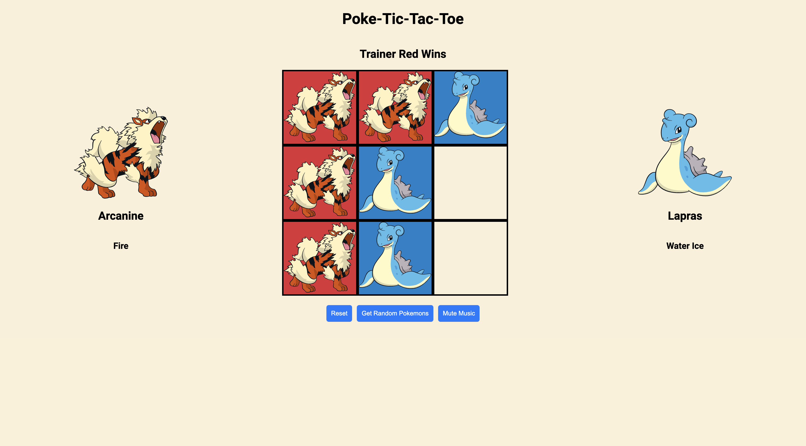

# Pokemon Tic-Tac-Toe

## Descriptions:

A two-player Tic-Tac-Toe game created using vanilla JavaScript, HTML, and CSS. Players take turns placing Pokémon on the board until one player gets three of their marks in a row (up, down, across, or diagonally), or until all squares are filled. This project emphasizes functions, API calls, and DOM manipulation in JavaScript.

## Getting Started:

You can access the game by clicking the link [here](https://debiddo618.github.io/pokemon-tic-tac-toe-js/).

## Game Images:

## Technologies Used:

- JavaScript
- HTML
- CSS

## Next Steps:

Here are some potential improvements to the project:

- Add AI player
- Allow players to pick their own Pokemon
- Score keeping across games
- Compatibility with mobile devices
